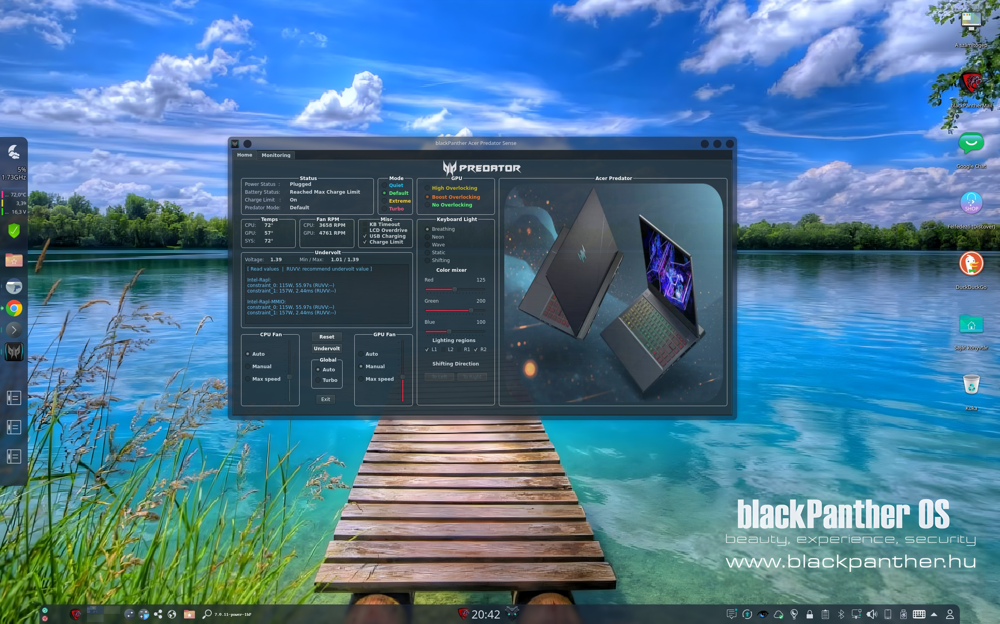

## PredatorSense™ clone for Acer Predators```PH*```
### Controls fan speed, gaming modes and undervolting on Linux. This application is intended for Acer Predator Helios 300 (2021) model



## Disclaimer:
* Secure Boot is **not** supported.
* Using this application with other laptops may potentially damage them. Proceed at your discretion.

## Usage:
- ```su/sudo``` is preinstalled required in order to access the Super I/O EC registers (acpi_ec module) and apply undervolt offsets

- First make sure to set the ```UNDERVOLT_PATH``` in ```aps.py``` to the appropriate location of the undervolt package
  - If you installed without sudo you can find where undervolt is located by doing
    ```
    which undervolt
    ```
  - Next set ```COREOFFSET``` and ```CACHEOFFSET``` to the mV that you determined to be stable via throttlestop on windows

 - From the command line you can run the main script as root:
```
su or sudo python3 aps.py
```

### Alternatively you can copy the .desktop file to your applications folder and launch it via it's icon

You will need to update these 2 lines first to point to the correct program directory
 - Set <path_to_PredatorSense> to the directory where you downloaded this project
```
Exec=sh -c "pkexec env DISPLAY=$DISPLAY XAUTHORITY=$XAUTHORITY sh -c 'cd <path_to_PredatorSense> && python3 aps.py'"
Icon=<path_to_PredatorSense>/PredatorLogo.png
```
 - Copy the file to the application directory

```
su or sudo cp predator-sense.desktop /usr/share/applications/
```
 - Now launch via the application and on initialization it will prompt for the user password

## Dependencies:
* blackPanther OS (autosetup):
```
installing blackPanther-aps
```
And start from main menu

* blackPanther OS and other distros from source:

```
dnf/apt-get install python3-pip
pip install qtpy
pip install git+https://github.com/georgewhewell/undervolt.git
dnf/apt-get install msr-tools
```

Packages:
* ```PySide6``` -> [PySide6](https://pypi.org/project/PySide6/)
* ```undervolt``` -> [Undervolt by georgewhewell](https://github.com/georgewhewell/undervolt)
* ```msr-tools``` -> [msr-tools by intel](https://github.com/intel/msr-tools)

